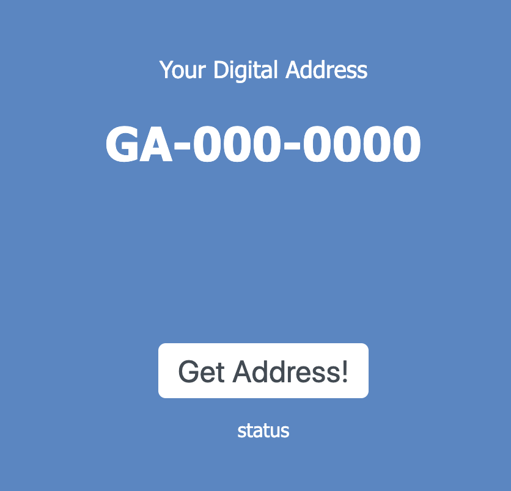

# LocateMe
At the end of last year (2017), the Ghanaian government released a digital addressing project called [GhanaPost](https://www.ghanaweb.com/GhanaHomePage/NewsArchive/Step-by-step-guide-How-to-register-on-Digital-Address-system-other-things-to-know-592296). Its idea is to give a unique adddress to every 5m x 5m area. 

My inner scientist tingled and with this experiment I intended to recreate the GhanaPost addressing system.

> Results were encouraging, I managed to generate the first two tokens  of the address. The challenge was getting the last token (4 digits) which are uniquely assigned and generated by an algorithm I am not aware of.

## Usage 
Run `yarn start` to start the server and access on `http://localhost:3000/`

## Screenshots

## Notes

